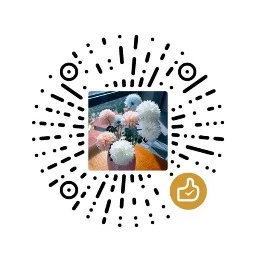

# [Typecho Harmony Hues](https://www.biibii.cn/ "Harmony Hues 主题")（和谐色调）主题

## 介绍

Typecho 主题-《HarmonyHues - 和谐色调》

- HarmonyHues主题的设计灵感源自自然界中的和谐之美
- 这是一款类拟态风格的主题，为什么这样命名？（因为当时让GPT起几个简洁的主题名称，百度翻译一下-和谐色调，然后就选这个，后面才发现，来不及改了...）
- 开发主题是为了简洁一点、自己开发能够更好的文章阅读和分享知识！（可以话来点 Star 支持一下）

主题预览链接：[BIIBII.CN](https://www.biibii.cn/)

## 功能

- 自适应布局（PC / 移动完美兼容）
- 顶部导航栏多模式切换（全屏沉浸式 / Mini简约式）
- 智能主题系统（深色模式 / 浅色模式 / 自动适配系统主题）
- 视觉增强方案：支持图片懒加载 + 点击放大预览（Lightbox效果）
- SEO优化：内置优化策略，轻松达成LightHouse 100分评级
- 文章编辑：内置文章内插入视频、网盘下载、提示框、折叠框功能
- 内置插件：代码高亮（支持多种语言）、回复邮件提醒、友情链接、sitemap、表情包等等（免插件）
- 特色独立页面：我的装备、明信片留言等等
- 特色侧边栏：时间一言、恶魔之眼、最新文章、最新评论等等
- 持续更新支持，更多惊喜等你发现...

## 安装与食用

1. 下载主题压缩包，解压后上传至 Typecho 主题目录（`usr/themes/`）
2. 【重要】把解压后的文件夹重命名为 `HarmonyHues`
3. 登录 Typecho 后台，进入外观管理，启用主题即可
4. 进入主题设置，根据需求进行配置

## 预览

|  |  |
| ------------------------------------------------------------------------- | --------------------------------------------------------------------------- |

## 联系

- 作者：[星语（G.E.N.G）](https://www.biibii.cn/about.html)
- 官网：[BIIBII.CN](https://www.biibii.cn/)
- 邮箱：[1431258805@qq.com](mailto:1431258805@qq.com)
- 主题BUG反馈：[点击这里](https://www.biibii.cn/bugfeedback.html)

## 捐款

💖 开源之路充满挑战，每一份代码背后都是无数个日夜的坚持。如果您也珍视这个项目带来的价值，诚邀您以捐赠的方式为项目注入成长能量——您的每一份支持都将转化为更优质的功能、更稳定的维护和更长远的发展。

|  |  |
| ---------------------------------------- | ------------------------------------------ |
